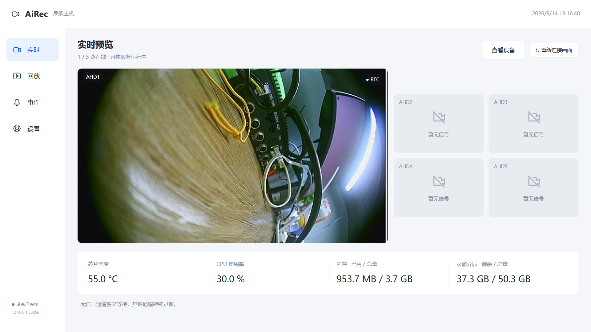
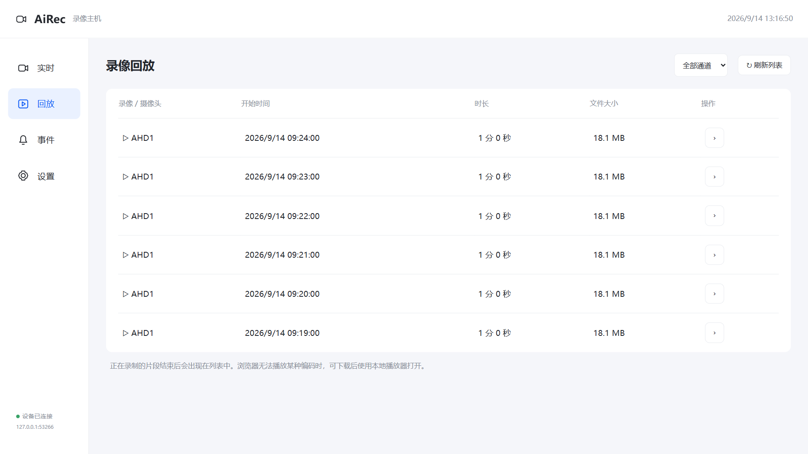
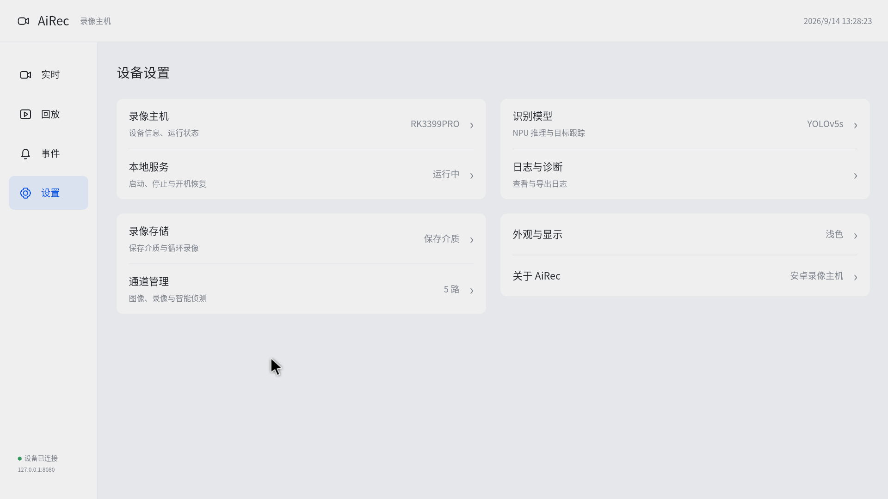

# AiRec 安卓录像主机

当前版本 **1.0.5**。

把 RK3399PRO 开发板变成一台录像机。安装 APK 后，直接在板卡屏幕上预览、录像和设置，也可以用局域网内的手机、平板或电脑访问。

运动的人、车、动物会触发事件，长时间停留只针对人。同一持续目标不重复记录。识别灵敏度可在通道设置中调整。

这是**装在开发板上的主机程序**。原来的 `AiRec-Android` 仍是装在手机上的客户端，两者可以配合使用。

## 安装与使用

1. 给开发板接好摄像头，再开机。当前适配的是这块五路 AHD 的 RK3399PRO 板卡、Android 9、ARM64 固件。
2. 把 `AiRec-Host-Android.apk` 复制到板卡，点击安装并打开，允许摄像头权限。当前固件需支持 `su 0`，应用会自动取得 AHD 设备的访问权限。
3. 在“设备设置”里选择录像介质、分段时长和识别参数。没有接摄像头的通道会显示“无信号”，其他通道继续运行。

首次使用请检查 Android 系统的日期、时间和时区，避免录像时间显示不正确。

模型和 Android 运行库已经放进 APK，**安装后不需要联网下载，也不需要 Python**。NPU 驱动和视频驱动由开发板固件提供，不能靠 APK 替换。

局域网访问地址为 `http://开发板IP:8080`。本次开发板使用 `http://192.168.10.209:8080`；安卓、鸿蒙客户端也填这个地址。当前版本不提供远程访问和账号登录，请在可信局域网使用。

## 界面预览

| 实时画面 | 回放列表 | 主机设置 |
| --- | --- | --- |
|  |  |  |

实时与列表图使用隔离测试数据；设置图来自开发板实屏。支持浅色、深色和跟随系统。

## 已有功能

- 五路画面、单路放大、后台录像；片段可选 1、3、5、10 分钟。
- 内置存储或外置 SD 卡；空间不足时循环删除本应用最旧的录像与事件。
- YOLOv5s ReLU + RKNN NPU 识别，ByteTrack 跟踪人、车和动物。
- 运动的人、车、动物触发事件；长时间停留仅针对人，同一持续目标不重复记录。
- 每路可独立开启人脸、车牌马赛克，处理后的画面用于预览、事件截图和新录像。
- 录像回放、全天时间轴接口、四类事件筛选、设备状态、批量复制通道参数。
- 主机界面和网页查看模型信息、下载诊断日志；原有手机客户端继续通过 HTTP 连接。

点击“停止录像”会停止采集和局域网服务；按系统返回键会保留后台录像。曾启动且未手动停止的服务会在开机后尝试恢复，并自动打开主机预览界面。首次安装需打开一次并授权；系统强行停止应用后需要重新打开。

升级时直接覆盖安装。**卸载应用会删除应用私有目录里的录像和设置，请先导出重要片段。**突然断电时，正在写入的 MP4 片段可能丢失，已完成片段可以继续回放。

## 当前限制

这块 Android 固件最多提供四个硬件 H.264 编码实例，第五路使用软件编码。实际帧率受负载影响，不能据此保证五路都达到 720p 25/30 帧。

当前只连接了 AHD1。AHD2～5 已能读取四宫格源并识别无信号，物理接口与四个画面区域的顺序还需逐路接入摄像头确认。具体实测结果见 [测试记录](docs/VERIFICATION.md)。

## 从源码生成 APK

用 Android Studio 打开本文件夹，安装 Android SDK 36，执行：

```powershell
.\scripts\build.ps1
```

生成的安装包在 `dist/AiRec-Host-Android.apk`。已附带 ARM64 原生库；修改 C++ 后，用 Android NDK r26d 重新编译：

```powershell
.\scripts\build.ps1 -Ndk 'D:\Android\android-ndk-r26d'
```

第一次构建需下载 Gradle 和构建依赖，之后可加 `-Offline`。这只影响开发电脑构建，板卡安装 APK 不需要联网。

Java 业务代码按 `capture`、`detection`、`storage`、`web`、`core` 分开；`cpp` 放视频访问和 NPU 封装，`assets/web` 放界面。网页脚本源文件在 `web-src/app.js`，修改后按 [开发说明](docs/DEVELOPMENT.md) 重新生成。

第三方组件与来源见 [许可说明](THIRD_PARTY_NOTICES.md)。

修改界面 JavaScript 后，先安装 esbuild 并重新生成页面包：

```powershell
npm install --global esbuild
.\scripts\build-web.ps1
.\scripts\build.ps1
```

仅修改 host.css 时直接构建 APK 即可。页面和后台录像服务分开维护。

人脸和车牌遮挡的用法及性能说明见 [马赛克设置](docs/PRIVACY.md)。
